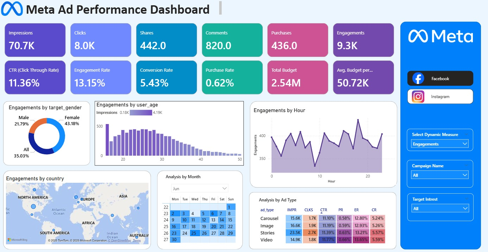

  <h1>Social Media Ad Analyzer</h1>
  
<strong>Meta Ads Performance Dashboard | Power BI | Data Analytics</strong>

---

## Project Overview
Developed a comprehensive **Power BI Dashboard** to analyze Meta Ads performance data. The project transforms raw marketing exports into actionable insights, focusing on audience segmentation, regional performance, and creative effectiveness.

### Key Objectives
* **Performance Tracking:** Monitoring real-time KPIs like CTR, CPC, and Conversions.
* **Audience Profiling:** Identifying high-value demographics.
* **Optimization:** Providing data-driven recommendations for budget reallocation.

---

## Key Insights & Findings
Through rigorous data modeling and visualization, the following trends were identified:

* **Top Performing Demographic:** High engagement observed in the **Female (18–30)** age bracket.
* **Winning Format:** **Video and Stories** ads outperformed static image carousels in terms of Click-Through Rate (CTR).
* **Conversion Funnel:** Identified a 15% drop-off rate between "Link Clicks" and "Landing Page Views," suggesting a need for faster mobile load times.

---

## Tech Stack & Skills
| Category | Tools / Skills |
| :--- | :--- |
| **Visualization** | Power BI Desktop, Power Query |
| **Data Modeling** | DAX (Data Analysis Expressions), Star Schema |
| **Domain** | Digital Marketing Analytics, MarTech |
| **Analysis** | Trend Analysis, Funnel Visualization, Cohort Analysis |

---

## Dashboard Preview

  

---

## Author
**Mandar Deshmukh** *Computer Science & Engineering Student* [LinkedIn]([https://linkedin.com/in/your-profile](https://www.linkedin.com/in/mandar-deshmukh-0810402b2?utm_source=share&utm_campaign=share_via&utm_content=profile&utm_medium=android_app))

---

  Built with Data.

